# Example C# Solution with NUnit tests

This is a simple example of a C# solution with NUnit tests.

Requirements:
- .NET Core __8+__
- Visual Studio (VS), Visual Studio Code (VS Code), or Rider IDE

Most of you will be more familiar with VS.
In this case, please install the last version, and ensure the __.NET Core v*8.0*__ is installed.

After installing and configuring .NET Core, and your IDE of choice,
try to open the solution and run the tests.

> Your development environment is correctly configured if (and only if) you can 
> successfully __open this solution__ and __run the tests__ in your IDE.

## Instructions

### How to verify the correct installation of .NET Core

1. Open a terminal (Command Prompt, __Powershell__, Bash, etc.)

2. Run the following commands:

    ```bash
    dotnet --list-runtimes
    dotnet --list-sdks
    ```

3. The output should be similar to the following one:

    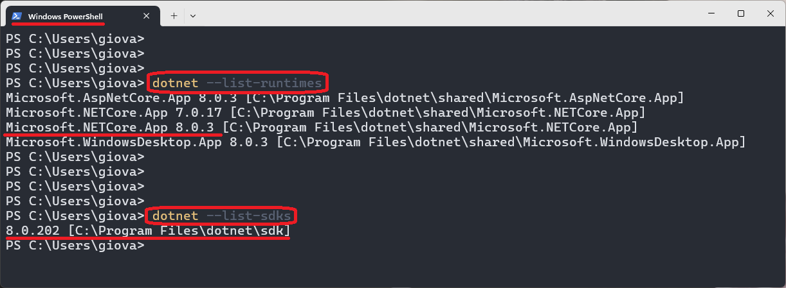

    Notice that:
    + there is a runtime names `Microsoft.NETCore.App` with version `8` or greater
    + there is a SDK with version `8` or greater

### How to install .NET Core (Minimal) on Windows

> The installation of .NET Core alone is very quick, 
> but if you only install that, you may then need to work with _VS Code_ or _Rider_ IDE.

1. Download the .NET Core SDK from the official website: https://dotnet.microsoft.com/download

2. Install the .NET Core SDK

3. Verify the installation as discussed above

### How to install Visual Studio and .NET on Windows

> The installation of VS is very long so do it ahead of time.

1. Download the last version of the Visual Studio installer from [here](https://visualstudio.microsoft.com/it/thank-you-downloading-visual-studio/?sku=Community&channel=Release&version=VS2022&source=VSLandingPage&cid=2030&passive=false)
    + the __community__ realease is free and it's enough 

    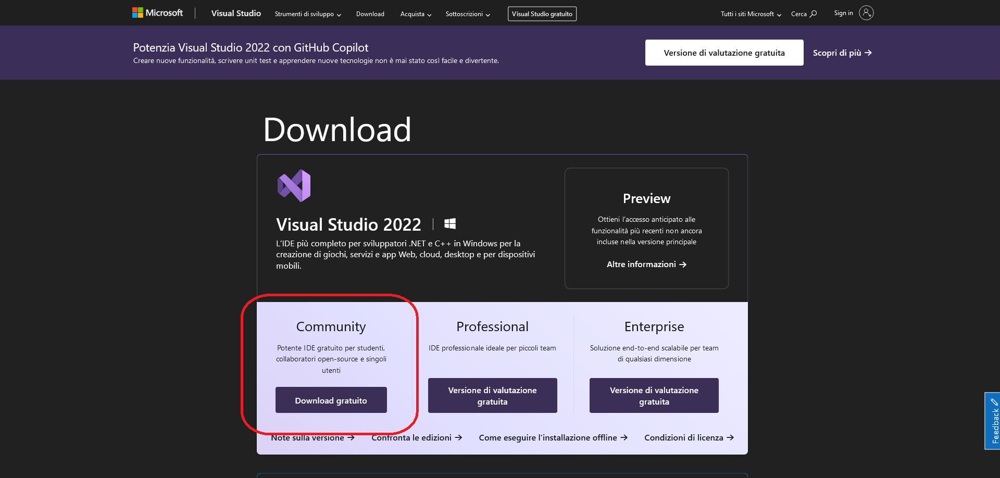

2. Start the installer

    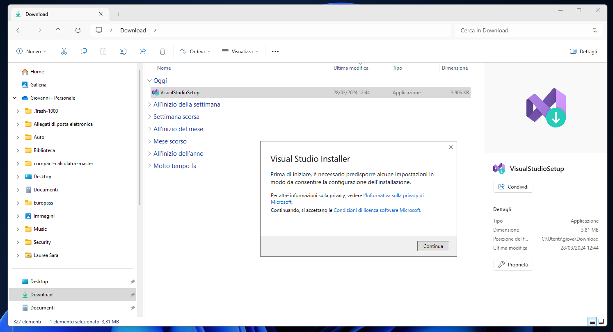

3. Press button __Continue__, and then wait for the installer to download the necessary files
    
    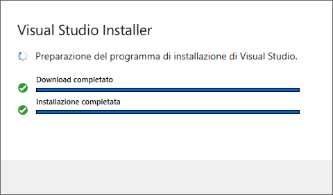

4. The installer will ask you to select what to install. 
Select the __.NET desktop development__ workload and click on __Install__ button

    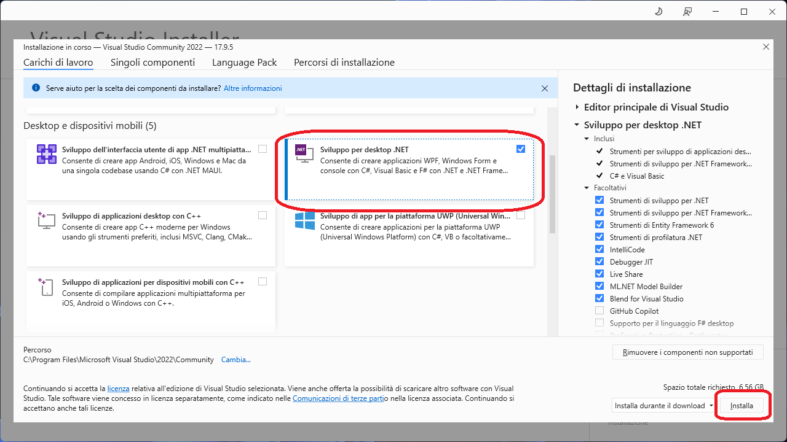

5. Wait for the installation to complete (this may take quite a while)
    
    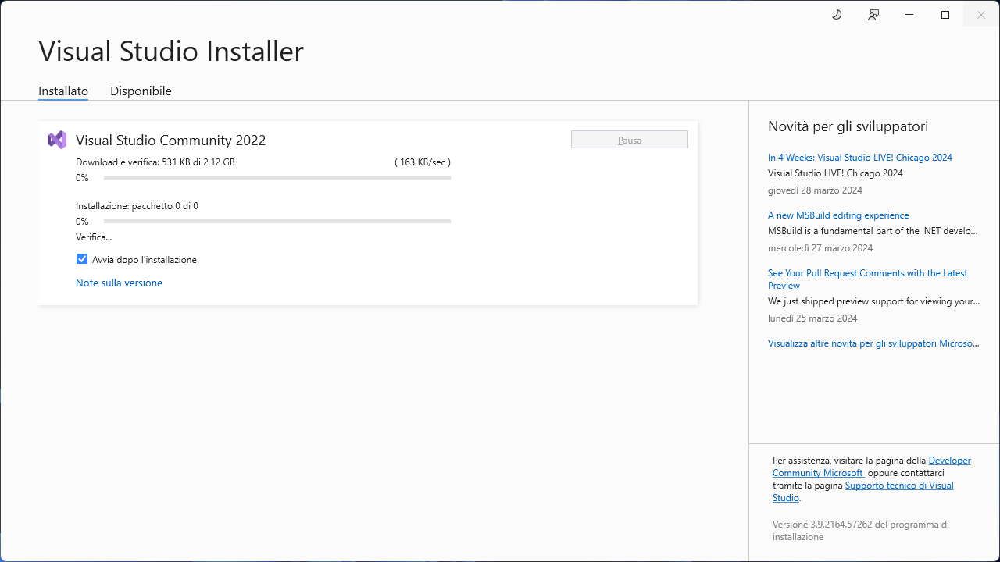

6. Once done with installation, the installer should automatically start Visual Studio.
In case it doesn't, you can start it from the installer itself.
    
    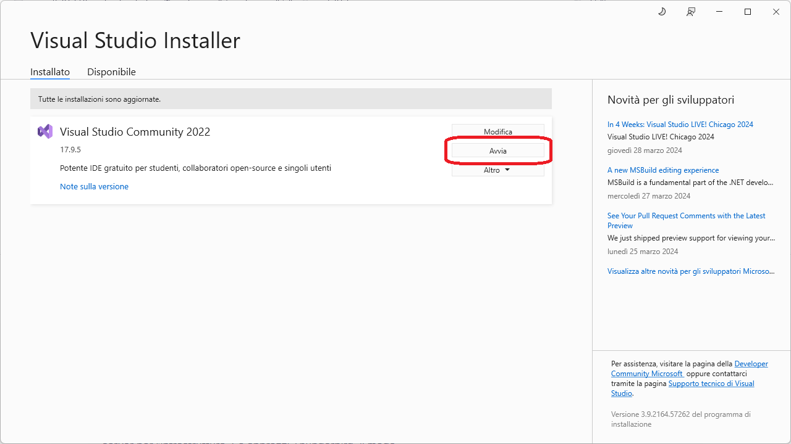

7. Also verify the installation of .NET Core as discussed above

### How to open the solution in Visual Studio

1. Open Visual Studio, the start page should look like this:

    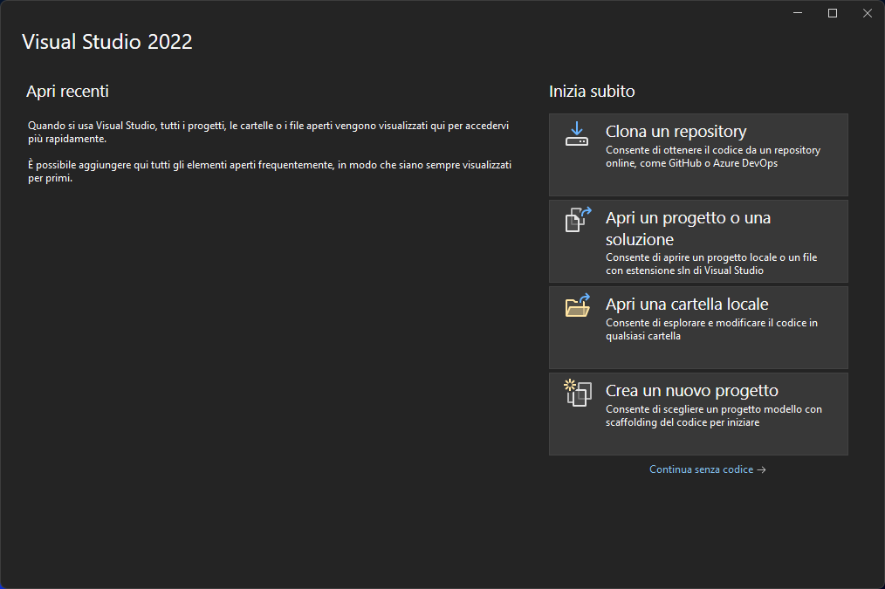

2. If you _already_ __cloned__ or __downloaded__ this example solution, click on __Open a project or solution__ 
and select the `ExampleSolution.sln` file from this repository.

    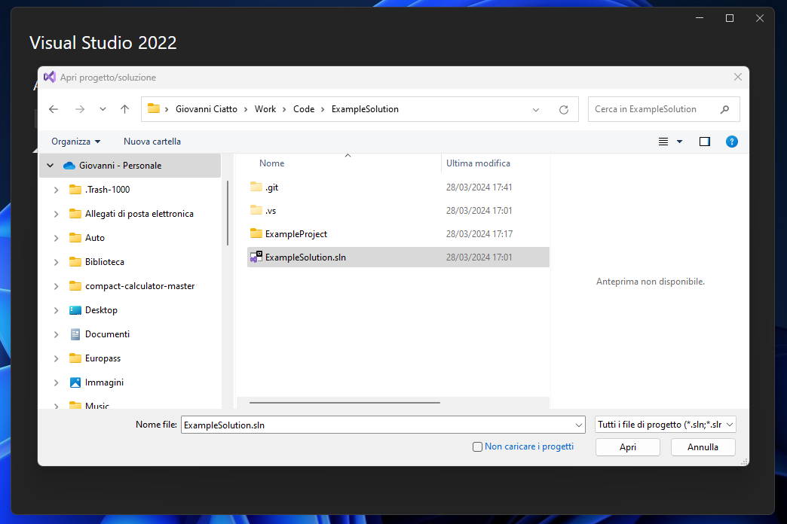

    otherwise, you can clone this repository from Visual Studio itself, by clicking on __Clone a repository__,
    and pasting the URL of this repository.

3. After opening the solution, you should see the following:

    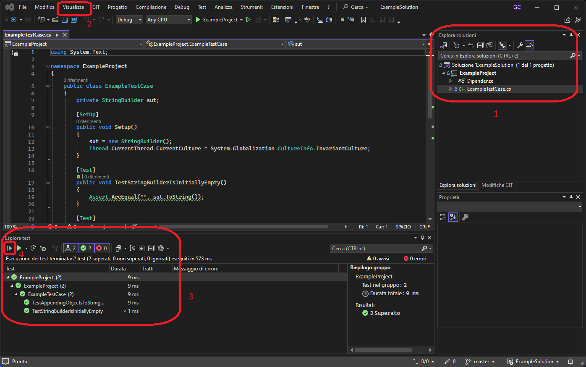

    1. Ensure that the solution explorer is visible and reports no loading error
    2. Click on __View__ then __Test Explorer__ to show the __test explorer section__
    3. Notice that there are some tests already present in the __test explorer__ section
    4. Click on the __Run All__ button to run all the tests
    5. The tests should run successfully


### How to install Visual Studio __Code__ on Windows

> This installation procedure assumes you have already installed __.NET Core__

> VS _Code_ is a lightweight alternative to Visual Studio

1. Download the last version of the Visual Studio Code installer from [here](https://code.visualstudio.com/download)

    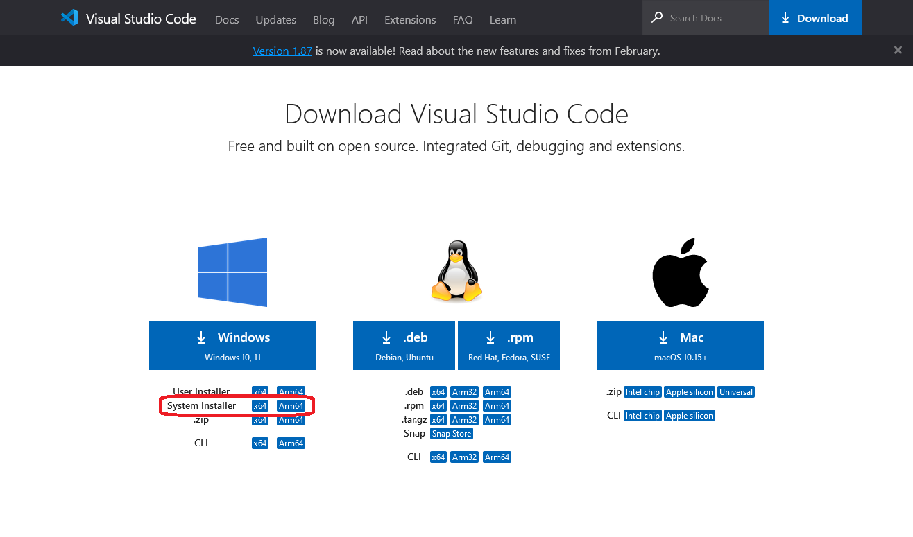

2. Start the installer, and follow the instructions, up to the end

3. Once done, open Visual Studio Code, and install the following extensions

    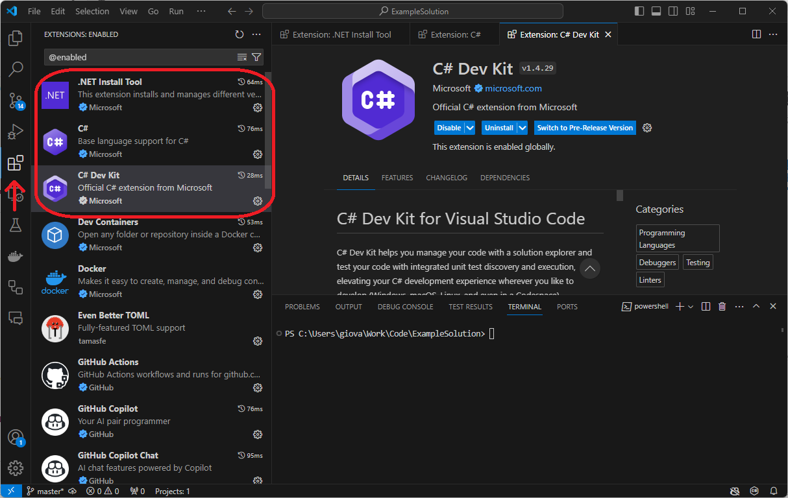

    Extensions to install:
    + .NET Install Tool
    + C#
    + __C# Dev Kit__

### How to open the solution in Visual Studio Code

1. __Download__ the example solution or __clone__ this repository on your machine

2. Open Visual Studio Code, and click on __File__ then __Open Folder__, then select the folder where you downloaded the solution

    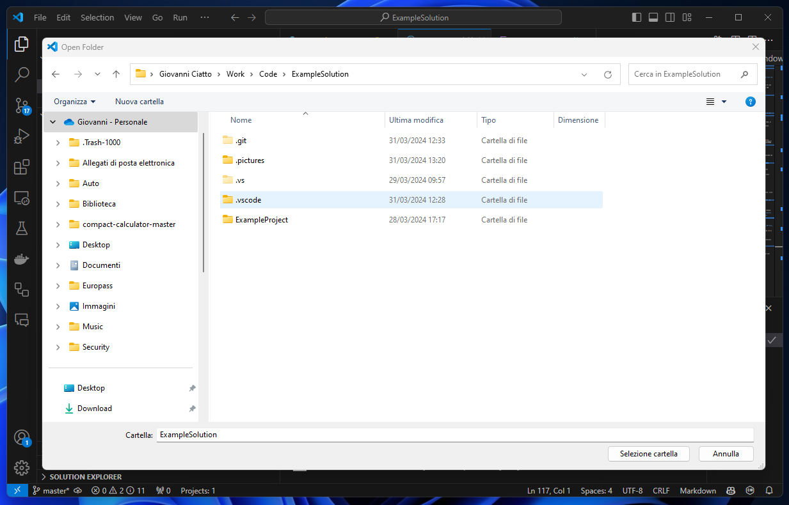

    - you won't be able to see the `ExampleSolution.sln` file in the dialog, but you need to select the folder containing it

3. Once the folder is opened, you may click on the __Testing__ button to show the __test explorer__ section

    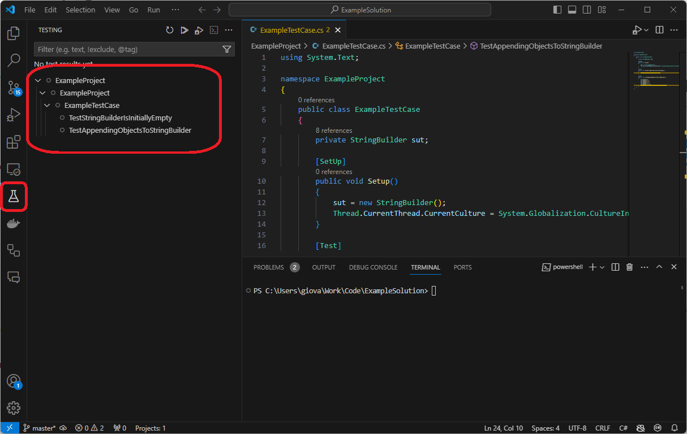

4. By clicking on the __Run All Tests__ button, you should see the tests running successfully

    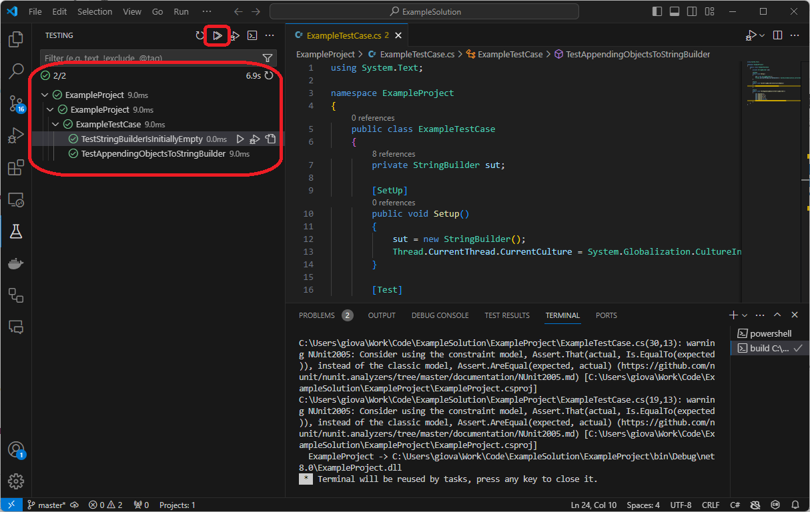